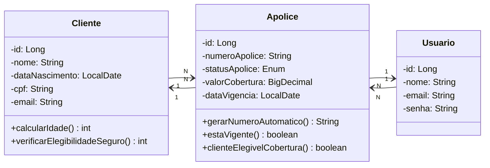

# ConectaLife - Backend

<div align="center">
   
</div>


## 1. Descrição

O **ConectaLife** é um sistema  de gerenciamento de seguros de vida voltado principalmente para estudantes e profissionais da área de tecnologia. A aplicação permite cadastrar, consultar, atualizar e excluir clientes e apólices, além de gerenciar os usuários responsáveis pelos registros, centralizando as informações e tornando os processos mais organizados e eficientes. 

O sistema também realiza a verificação de elegibilidade do cliente com base na data de nascimento, exigindo idade mínima de 18 anos, além da validação das regras de negócio definidas no escopo do projeto. Quando o cliente é elegível, ele pode seguir no fluxo de contratação e gerenciamento da apólice. 

------

## 2. Sobre esta API

A API do **ConectaLife** foi construída para gerenciar as entidades **Cliente**, **Apolice** e **Usuario**, permitindo persistir e relacionar os dados principais do sistema de seguros em um banco relacional MySQL.

Por meio dela, é possível organizar o cadastro de clientes, controlar apólices de seguro, registrar os usuários responsáveis pelas operações e aplicar validações como cálculo de idade e verificação de elegibilidade para adesão ao seguro. 

### 2.1. Principais Funcionalidades

1. Cadastrar, consultar, atualizar e excluir clientes. 
2. Cadastrar, consultar, atualizar e excluir apólices. 
3. Gerenciar usuários responsáveis pelos registros do sistema. 
4. Validar a idade do cliente a partir da data de nascimento. 
5. Verificar a elegibilidade do cliente para contratação do seguro. 
6. Relacionar clientes e usuários com apólices por meio de mapeamento JPA. 

------

## 3. Diagrama de Classes 




------

## 4. Diagrama Entidade-Relacionamento (DER)

<p align="center">
  
</p>


------

## 5. Tecnologias utilizadas

| Item                          | Descrição     |
| ----------------------------- | ------------- |
| **Servidor**                  | Tomcat        |
| **Linguagem de programação**  | Java          |
| **Framework**                 | Spring        |
| **ORM**                       | Hibernate/JPA |
| **Banco de dados Relacional** | MySQL         |


------

## 6. Estrutura das Entidades

### Classe: `Cliente`

| Atributo         | Tipo        | Descrição                                                    |
| ---------------- | ----------- | ------------------------------------------------------------ |
| `id`             | `Long`      | Identificador único do cliente no sistema.                   |
| `nome`           | `String`    | Armazena o nome completo do cliente para identificação e consultas. |
| `dataNascimento` | `LocalDate` | Armazena a data de nascimento e permite calcular a idade do cliente. |
| `cpf`            | `String`    | Armazena o CPF do cliente como documento de identificação.   |
| `email`          | `String`    | Armazena o endereço de e-mail do cliente para contato e identificação. |

### Classe: `Apolice`

| Atributo         | Tipo         | Descrição                                                    |
| ---------------- | ------------ | ------------------------------------------------------------ |
| `id`             | `Long`       | Identificador único da apólice no banco de dados.            |
| `numeroApolice`  | `String`     | Armazena o número identificador da apólice.                  |
| `statusApolice`  | `Enum`       | Indica a situação atual da apólice, como ativa, pendente, cancelada ou encerrada. |
| `valorCobertura` | `BigDecimal` | Armazena o valor monetário da cobertura com precisão adequada para valores financeiros. |
| `dataVigencia`   | `LocalDate`  | Armazena a data de vigência da apólice.                      |

### Classe: `Usuario`

| Atributo | Tipo     | Descrição                                                    |
| -------- | -------- | ------------------------------------------------------------ |
| `id`     | `Long`   | Identificador único do usuário responsável pelas operações do sistema. |
| `nome`   | `String` | Armazena o nome do usuário para identificação na aplicação.  |
| `email`  | `String` | Armazena o e-mail utilizado para identificar e localizar o usuário. |
| `senha`  | `String` | Armazena a senha utilizada para acesso ao sistema.           |

------

## 7. Regras de negócio

- A elegibilidade do cliente é validada com base na **data de nascimento**, utilizando cálculo de idade para verificar se o cliente possui pelo menos 18 anos. 
- O sistema bloqueia a adesão ao seguro quando o cliente não atende aos critérios definidos no escopo. 
- A entidade **Cliente** se relaciona com **Apolice** em uma associação **1:N**, enquanto **Usuario** também se relaciona com **Apolice** em **1:N**, com a apólice mantendo a referência `N:1` para ambas as entidades. 

------

## 8. Configuração e Execução

1. Clone o repositório.
2. Abra o projeto na IDE de sua preferência.
3. Configure o banco de dados MySQL.
4. Verifique as configurações de conexão da aplicação.
5. Execute o projeto no servidor Tomcat.

### Exemplo de execução

```bash
git clone https://github.com/VidaConecta/ConectaLife
```

------

## 9. Status do Projeto

🚧 Projeto em desenvolvimento. O README pode ser atualizado conforme a evolução das entidades, relacionamentos, endpoints e diagramas do sistema.